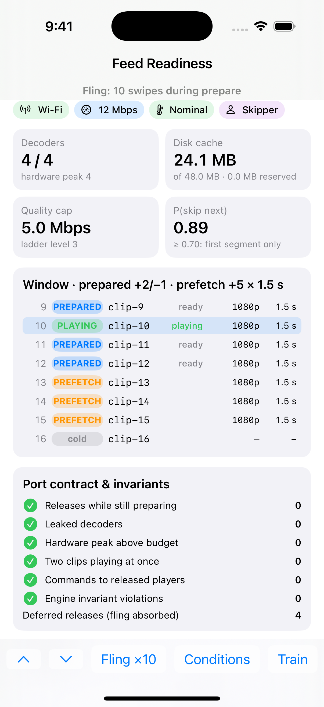
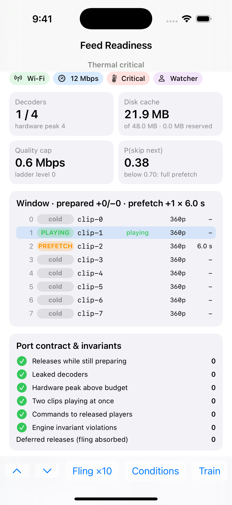
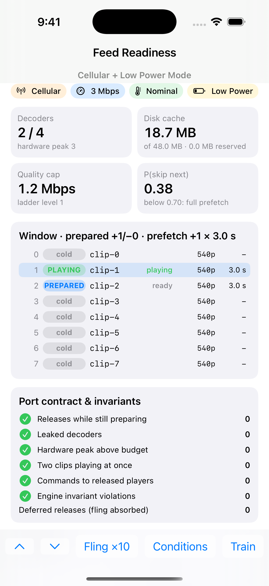

# Feed Readiness — Demo App

**Fling through a short-video feed and watch what the engine actually holds. The console shows which clips own a hardware decoder, which have bytes on disk and at what quality. It also shows what happens to all of that when the phone goes offline, overheats, or the user turns out to be a skipper.**

[](https://github.com/rajatslakhina/video-feed-readiness-kit-demo-app/actions/workflows/ci.yml)
[](https://github.com/rajatslakhina/video-feed-readiness-kit-demo-app/actions/workflows/simulator.yml)

This app is the runnable companion to **[FeedReadiness](https://github.com/rajatslakhina/video-feed-readiness-kit)**, a resource-budgeted readiness engine for vertical video feeds. It is a separate Xcode project. It consumes the library as a **remote Swift package pinned to a release** (`upToNextMajorVersion` from `1.0.0`), never through a local path or a branch.

## Screenshots (iOS Simulator, in CI)

These come from CI, not from the author's Mac. The [Simulator run](https://github.com/rajatslakhina/video-feed-readiness-kit-demo-app/actions/workflows/simulator.yml) workflow builds the app on a GitHub-hosted `macos-15` runner (Xcode 16.4) and installs it on an iPhone 16 Pro Simulator (iOS 18.5). It launches the app once per `-scenario`, checks that the process is still running after the scenario has played, and commits what the Simulator shows. The numbers are what the engine reported on that run. A headless run of the same six scenarios on Linux shows the same windows, cache sizes and quality caps.

| Launch state (`-scenario steady`, the default) | `-scenario fling` |
|:---:|:---:|
|  |  |
| Two swipes in on Wi-Fi: 1 clip playing, 3 prepared (one behind, two ahead), 3 prefetched. All 4 decoders in use, 5.0 Mbps cap | Ten swipes with no pause, so the user leaves clips whose decoders are still preparing. Every contract check stays at 0, and 4 releases waited for their prepares to finish. P(skip next) is now 0.89, so prefetches are 1.5 s |

| `-scenario hot` | `-scenario offline` |
|:---:|:---:|
|  |  |
| One swipe, then thermal state critical. One decoder is left, the cap is 0.6 Mbps and the playing clip has switched to 360p. Its cached bytes are 1080p, so its row shows **–** | One swipe on Wi-Fi, the network drops, then another swipe. The new clip plays, the next one is prepared because its first segment is on disk, and nothing is fetched |

| `-scenario skipper` | `-scenario cellular-low-power` |
|:---:|:---:|
|  |  |
| Ten unhurried swipes as a skipper. P(skip next) is 0.89, so every prefetch is 1.5 s, and all 4 decoders are still in use | 3 Mbps cellular with Low Power Mode, then one swipe. The cap is 1.2 Mbps (540p), one clip is prepared ahead and nothing behind, and prefetch depth is 3 s |

## Why this matters

"Prefetch the next N videos" is the whiteboard answer to the feed system-design question. On a phone it fails in ways that only show up under real conditions:

- the hardware decoder budget;
- flings that race your own teardown;
- playback commands that overtake each other;
- device state (network, heat, battery, memory) that should shrink the window;
- users whose attention makes a fixed prefetch depth wrong.

This console makes each of those visible. Every number on screen comes from the engine's own snapshot or from the contract-checking player port, not from the UI.

## What you can do in the app

The app launches into the **steady** state: two swipes into the feed on Wi-Fi. Each row below starts from that state.

| Control | What happens | What to look at |
|---|---|---|
| **▼ / ▲** | Moves the cursor one clip | The window card re-plans around the new clip: 1 **PLAYING**, 3 **PREPARED** (holding a decoder: one behind, two ahead) and 3 **PREFETCH** (bytes on disk, no decoder). The next row is **cold** |
| **Fling ×10** | Ten swipes with no pause, while every decoder takes 120 ms to prepare | *Deferred releases* rises (4 in the fling screenshot above, and 4 when this exact sequence is run headless), and downloads for clips that left the window are cancelled. *Releases while still preparing*, *Leaked decoders*, *Hardware peak above budget*, *Two clips playing at once* and *Commands to released players* all stay at **0**. The fling also teaches the skip model a skipper, so new prefetches shrink to 1.5 s |
| **Conditions → Offline** | The network drops | The PREFETCH rows disappear: nothing new is fetched, and downloads still in flight would be cancelled. The playing clip keeps playing and the next clip stays prepared, because their players already buffered. Nothing else gets a decoder unless its first segment is on disk. Add Low Power Mode or heat on top and the clip still plays at its prepared 1080p: offline, the quality cap is a preference, not a reason to stop |
| **Conditions → Thermal: critical** | The phone overheats | Decoders drop to 1, the quality cap falls to 0.6 Mbps, and the playing clip switches to 360p *make-before-break* (*Make-before-break hand-offs* = 1). While the switch is in progress, its row reads 1080p→360p. Clips whose cached bytes are 1080p show **–** at 360p, because 1080p bytes cannot feed a 360p decoder |
| **Conditions → Thermal: nominal** (after critical) | The phone cools | Quality does not jump straight back. It climbs one level per 4 s of sustained headroom, and each swipe, condition change or completed download checks the timer. Swipe every few seconds and the cap goes 0.6 → 1.2 → 2.5 → 5.0 Mbps (*Quality up* = 3) |
| **Conditions → Toggle Low Power Mode** | Low Power Mode turns on | One clip prepared ahead, none behind, prefetch +2, and the quality cap drops to 1.2 Mbps (540p) |
| **Train → 10 swipes as a skipper** | The on-device skip model learns this user | *P(skip next)* rises past 0.70 and the window title switches to "× 1.5 s": new prefetches fetch only the first segment |

Every 17th clip in the compiled-in catalog has a broken manifest (no renditions). It shows as a cold row with no rendition, and the engine plans around it instead of crashing.

The launch argument `-scenario <steady|fling|hot|offline|skipper|cellular-low-power>` plays one of these on launch. The shared scheme carries all six, disabled, under *Edit Scheme → Run → Arguments*.

## How to run it

1. `git clone https://github.com/rajatslakhina/video-feed-readiness-kit-demo-app.git`
2. Open `Demo.xcodeproj` in Xcode 16 or later. Xcode resolves `video-feed-readiness-kit` from GitHub at the pinned release.
3. Select the **Demo** scheme and any iPhone Simulator running iOS 17 or later.
4. **Build & Run** (⌘R).

## How it is put together

```
Demo/
  DemoApp.swift          @main; owns the compiled-in catalog (80 clips, 4-rung ladder),
                         the engine budgets (4 decoders, 48 MB cache) and the -scenario parsing
  FeedConsoleModel.swift @MainActor @Observable model: drives FeedEngine with SimulatedPlayer
                         (120 ms prepare) and SimulatedTransport (6 MB/s); one action at a time;
                         swipes use the engine's own cursor (move(by:)), never a stale snapshot
  ConsoleView.swift      one screen: conditions, metrics, the window, contract checks, counters
Scripts/
  simulator-screenshots.sh  CI: build, install, launch each scenario, check it is alive, screenshot
```

No real video is decoded. `SimulatedPlayer` stands in for `AVPlayer`, and it also *checks the main clauses of the port contract*. It counts:

- how many decoders are live at once;
- any release that arrives while that player is still being created;
- how many clips are playing at once;
- any `play` or `pause` sent to a player that was already released or never prepared, and any `play` for a player whose prepare failed.

That is how the fling result above is measured rather than asserted. The library's tests also drive this simulated player with deliberate contract violations, to prove that each of its counters really counts.

## Verification

| What | Where | Result |
|---|---|---|
| Resolve `video-feed-readiness-kit` from GitHub at the pinned release | [CI](https://github.com/rajatslakhina/video-feed-readiness-kit-demo-app/actions/workflows/ci.yml), `macos-15`, Xcode 16.4 | Resolves `1.0.0` (the log prints `Package.resolved`) |
| Build the app for `generic/platform=iOS Simulator` | CI | Passing, with no Swift compiler warnings in the build log |
| Build, install and launch on an iPhone 16 Pro Simulator (iOS 18.5) in six scenarios, and check that the process is alive after each | [Simulator run](https://github.com/rajatslakhina/video-feed-readiness-kit-demo-app/actions/workflows/simulator.yml), `macos-15` | Passing; the screenshots above |
| `FeedConsoleModel` against the library: every launch scenario, and every control in the table above starting from the launch state | Linux, headless, Swift 6.1.2 | Every contract counter at 0 and no invariant violations, in every case. The numbers in the table come from this run |

**Not verified:**

- **The app has not been run on the author's Mac or on a device.** A local Simulator run was planned and skipped: Xcode and the Simulator on that Mac already had unrelated work open, and running the demo there would have meant clicking through it. The CI Simulator run above replaces it.
- **Nobody tapped the controls in a Simulator.** The screenshots come from launch scenarios, which call the same model actions as the buttons. The control-by-control effects in the table were checked headless on Linux.
- **No real video is decoded.** `SimulatedPlayer` stands in for `AVPlayer`, so real decoder limits, frame drops and AVFoundation timing are out of scope. The 120 ms prepare latency and the 6 MB/s transport are illustrative values.

MIT licensed.
